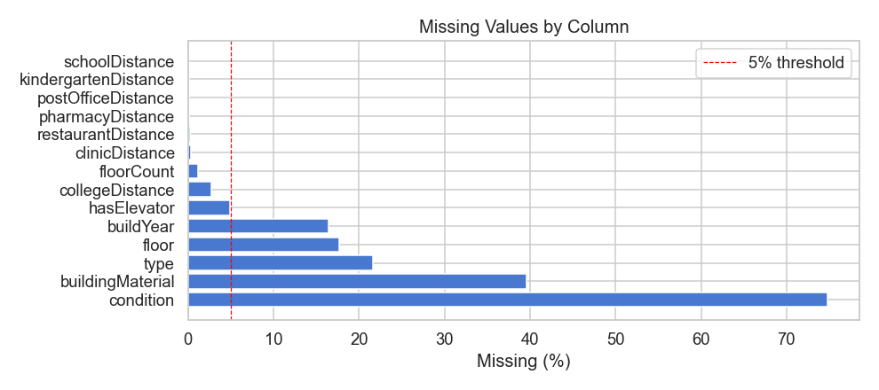
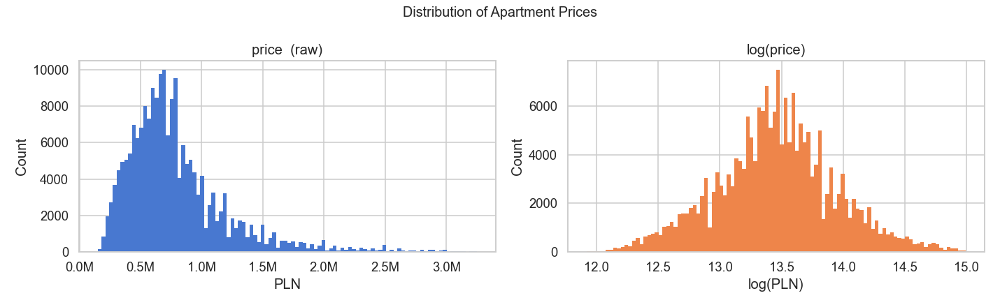
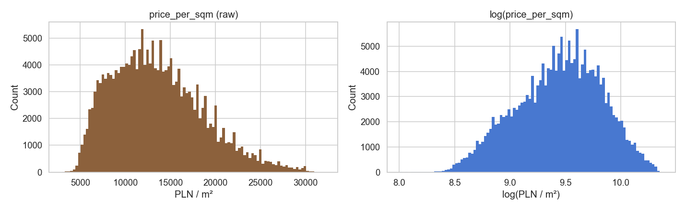
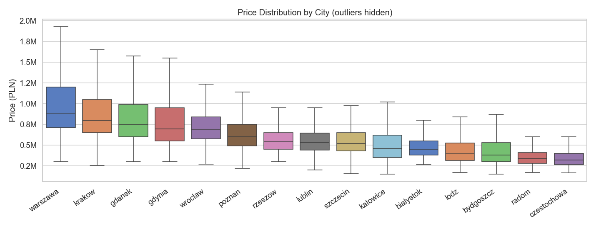
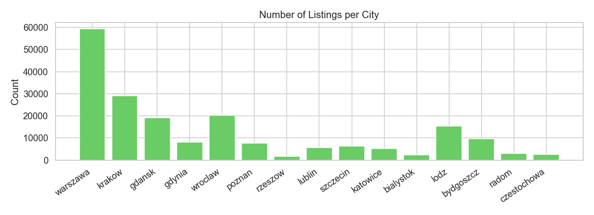
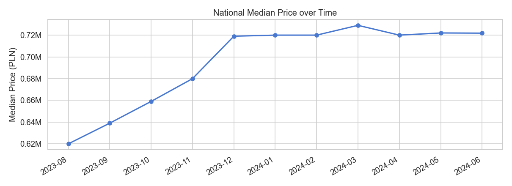
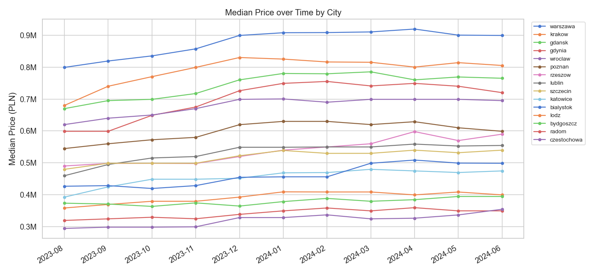
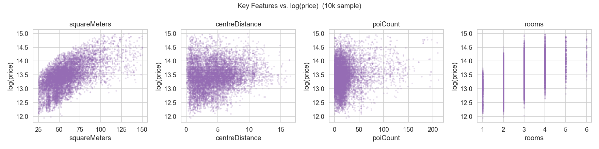
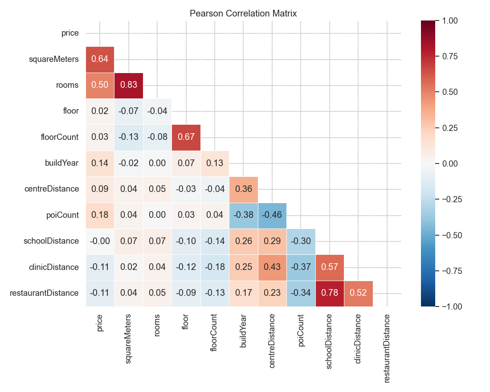
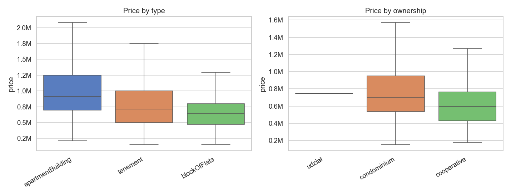

# EDA Findings — Apartment Prices in Poland

**Dataset:** `data/processed/master_sales_dataset.csv`
**Date:** 2026-03-18
**Author:** EDA conducted via `notebooks/02_eda.ipynb` → `src/analysis/02_eda.py`
**Figures:** `notebooks/figures/`

---

## 1. Dataset Overview

| Property | Value |
|---|---|
| Total rows | ~195,568 |
| Columns | 29 |
| Time span | August 2023 – June 2024 (11 monthly snapshots) |
| Cities | 15 (Warsaw, Kraków, Gdańsk, Gdynia, Wrocław, Poznań, Rzeszów, Lublin, Szczecin, Katowice, Białystok, Łódź, Bydgoszcz, Radom, Częstochowa) |

---

## 2. Missing Values

| Column | Missing (%) | Decision |
|---|---|---|
| `condition` | ~75% | **Exclude** from models |
| `buildingMaterial` | ~40% | **Exclude** from models |
| `type` | ~21% | Use with caution / exclude rows if needed |
| `floor` | ~17% | Use as optional fixed effect |
| `buildYear` | ~16% | Use as optional fixed effect |
| `collegeDistance`, `hasElevator` | ~3–5% | Acceptable; drop missing rows |
| All other columns | <1% | No concern |

**Key finding:** The three core modeling variables — `price`, `squareMeters`, and `centreDistance` — have no missing values. The panel index (`city`, `snapshot_month`) is also complete.

---

## 3. Target Variable: `price`

- **Raw distribution** is strongly right-skewed (skewness ≈ 3). The bulk of listings falls between 0.4M and 1.0M PLN, with a long tail extending to 3M+.
- **log(price)** is approximately symmetric and close to Normal — confirming that the model should use **log(price)** as the response variable.
- The 1st–99th percentile range is approximately **200k – 2.5M PLN**; extreme outliers above this threshold account for roughly 2% of observations.

- Unit price (`price_per_sqm`) ranges from ~5,000 to ~30,000 PLN/m², with a mode around 12,000–14,000 PLN/m².
- `log(price_per_sqm)` is also approximately Normal, further validating the log-scale modeling approach.

---

## 4. City-level Analysis

Cities can be broadly grouped into three price tiers:

| Tier | Cities | Approx. Median Price |
|---|---|---|
| High | Warszawa, Kraków, Gdańsk, Gdynia, Wrocław | > 0.8M PLN |
| Mid | Poznań, Rzeszów, Lublin, Szczecin | 0.55M – 0.80M PLN |
| Low | Katowice, Białystok, Łódź, Bydgoszcz, Radom, Częstochowa | < 0.50M PLN |

The highest-to-lowest median price ratio is approximately **3×** (Warszawa vs. Częstochowa), demonstrating strong city-level heterogeneity that justifies a **hierarchical model with city-level intercepts**.

**Sample size imbalance is severe:** Warszawa contributes ~59,000 listings while Rzeszów has only ~1,500. This imbalance is a core motivation for Bayesian partial pooling — smaller cities borrow statistical strength from the national distribution rather than being estimated on sparse local data alone.

---

## 5. Temporal Analysis

- **National median price** rose sharply from ~0.62M PLN in August 2023 to ~0.72M PLN by December 2023 (+16% in 4 months).
- From January 2024 onward, prices plateaued and fluctuated in a narrow band of 0.71M–0.73M PLN.

- **City-level trends diverge significantly:**
  - Kraków, Gdańsk, and Gdynia exhibit strong appreciation through autumn 2023.
  - Katowice shows a notable decline in early 2024.
  - Białystok displays high month-to-month noise, consistent with its small sample size.
  - Wrocław and Warszawa follow a broadly similar trajectory but at different price levels.
- This **city-specific, asynchronous temporal variation** is the primary empirical motivation for the **Time-Varying Parameters (TVP)** component of the model. A static hierarchical model (Stage 2) would fail to capture these diverging trajectories.

---

## 6. Continuous Features vs. Price

### Correlation with `price` (Pearson, from full matrix)

| Feature | r with price | Notes |
|---|---|---|
| `squareMeters` | **0.64** | Strongest predictor; relationship is positive but saturates at large sizes |
| `rooms` | **0.50** | High collinearity with `squareMeters` (r = 0.83) — use one or orthogonalize |
| `poiCount` | 0.18 | Positive; higher POI density (city centres) → higher prices |
| `buildYear` | 0.14 | Newer buildings are slightly more expensive |
| `centreDistance` | 0.09 | **Weak global correlation** — but this is expected due to city-level confounding. Within each city, the negative relationship is the theoretically justified `β_{c,t}` slope |
| `floor`, `floorCount` | ~0.02–0.03 | Negligible direct effect on price |
| `clinicDistance`, `restaurantDistance` | –0.11 | Weak negative: proximity to amenities slightly increases prices |

**Multicollinearity notes:**
- `squareMeters` – `rooms`: r = 0.83 → include only `squareMeters` in the base model.
- `clinicDistance` – `restaurantDistance`: r = 0.52; `schoolDistance` – `clinicDistance`: r = 0.57 → avoid including all distance features simultaneously.
- `centreDistance` – `poiCount`: r = –0.46 → these capture related but distinct spatial dimensions (raw distance vs. density of nearby activity).

---

## 7. Categorical Features

- **Apartment type:** `apartmentBuilding` listings have the highest median price (~0.95M PLN), followed by `tenement` (~0.80M), then `blockOfFlats` (~0.75M). However, this ordering is largely confounded with city (Warsaw has more `apartmentBuilding` listings).
- **Ownership:** `udział` (shared ownership) shows a notably narrow distribution (very few observations); `condominium` and `cooperative` are the dominant categories with similar distributions.
- **Binary amenities:** parking spaces, balconies, and elevators each show a modest positive price premium (~5–15%), though these effects are also city-confounded.

---

## 8. Key Findings Summary

| Finding | Implication for Modeling |
|---|---|
| `price` is right-skewed; `log(price)` ≈ Normal | Use **log(price)** as response variable |
| ~3× price gap between highest and lowest cities | Hierarchical intercepts `α_{c,t}` are essential |
| Severe sample imbalance across cities | Bayesian **partial pooling** prevents overfitting in small cities |
| Clear temporal trend (esp. Aug–Dec 2023), then plateau | Time axis must be included; static models will miss the 2023 surge |
| City-level temporal trends diverge | **Time-Varying Parameters** per city justified; a single national trend is insufficient |
| `squareMeters` – `rooms` multicollinearity (r = 0.83) | Use `squareMeters` only; drop `rooms` from base model |
| `centreDistance` globally weak but theoretically key | Model as city-level **TVP slope** `β_{c,t}`; city-level grouping will reveal the true negative effect |
| `condition` (75% missing), `buildingMaterial` (40% missing) | **Exclude** from all models |
| `log(price)` mean ≈ 13.3, std ≈ 0.6 | Use as reference for prior on `ᾱ` in hierarchical model |

---

## 9. Recommended Feature Set for Modeling

| Feature | Role | Transform |
|---|---|---|
| `log(price)` | Response variable | log |
| `city` | Grouping variable (hierarchy) | — |
| `snapshot_month` | Time index (T = 11) | integer 0–10 |
| `squareMeters` | Fixed covariate | standardize |
| `centreDistance` | TVP slope covariate | standardize |
| `poiCount` | Optional fixed covariate | standardize |
| `buildYear` | Optional fixed covariate | standardize |
| `floor` | Optional fixed covariate | as-is (after imputation) |
| `hasBalcony`, `hasElevator`, `hasParkingSpace` | Optional binary covariates | 0/1 encode |
